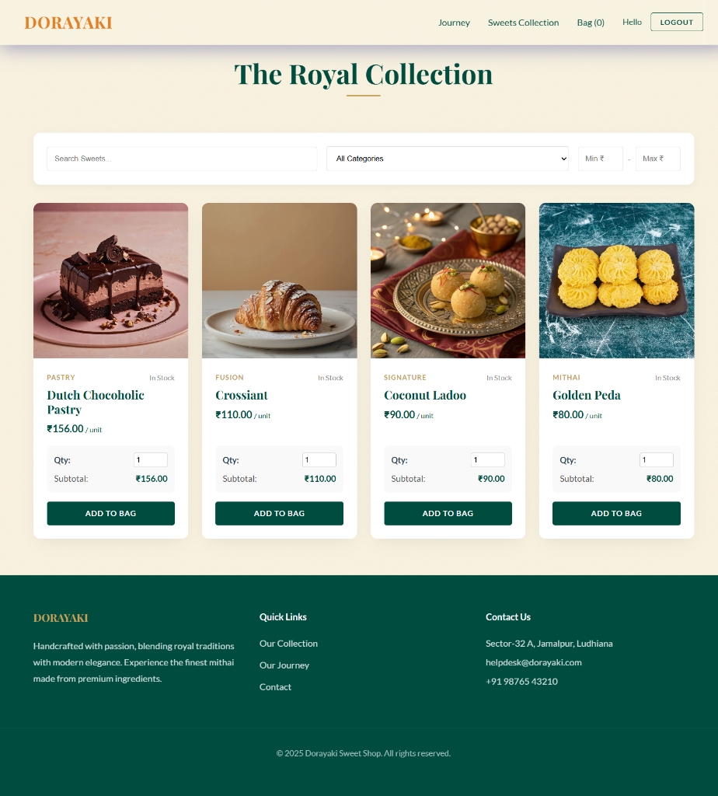
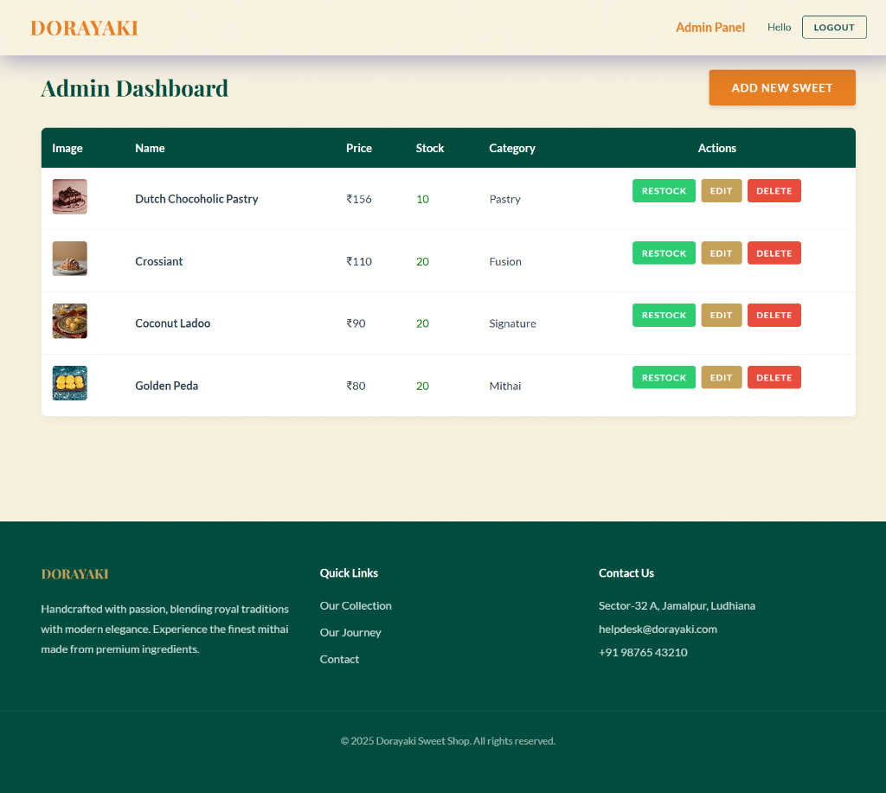
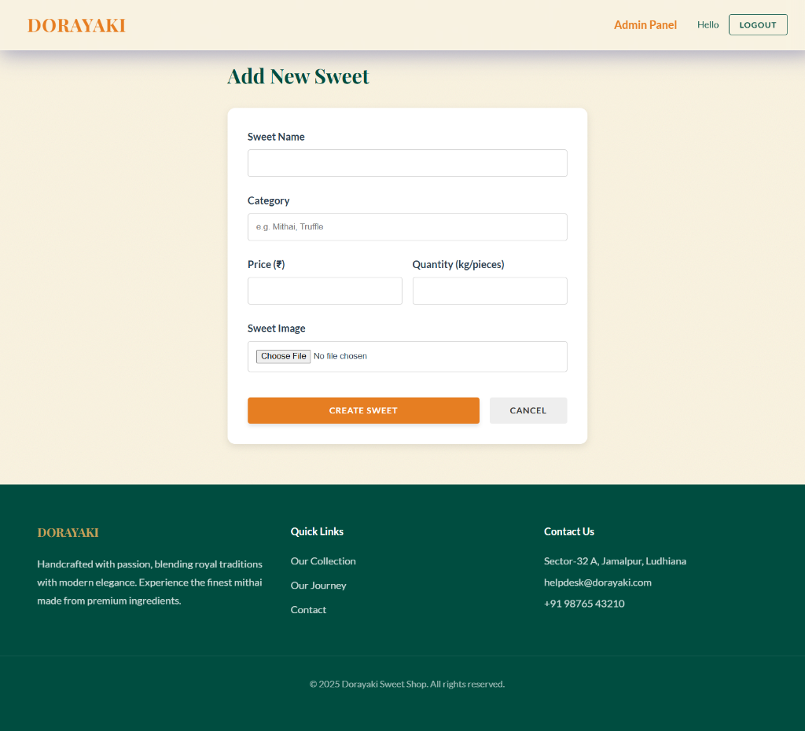

# Dorayaki Sweet Shop Management System

A full-stack Sweet Shop Management System built with the MERN stack (MongoDB, Express, React, Node.js). This project demonstrates a robust RESTful API, secure authentication and a modern themed frontend.

## 🚀 Features

- **User Authentication**: Secure Register/Login with JWT. Role-based access (Customer vs Admin).
- **Product Management**: Admin can Add, Update, Delete, and Restock sweets.
- **Search & Filter**: Find sweets by Name, Category, and Price Range.
- **Shopping Cart**: Client-side cart with quantity management and checkout.
- **Royal Design**: A visually stunning UI fusing Indian Heritage with Modern Patisserie aesthetics.
- **Search Functionality**: Advanced filtering backend with responsive frontend UI.

## 🛠️ Technology Stack

- **Backend**: Node.js, Express.js, MongoDB (Mongoose), JWT, Cloudinary (Image Upload).
- **Frontend**: React (Vite), CSS Modules/Variables, Axios.
- **Testing**: Jest, Supertest.

## ⚙️ Setup Instructions

### Prerequisites
- Node.js (v14+)
- MongoDB Atlas URI (or local MongoDB)
- Cloudinary Account (for image uploads)

### 1. Backend Setup
```bash
cd backend
npm install
```

Create a `.env` file in the `backend` directory:
```env
PORT=5000
MONGO_URI=your_mongodb_connection_string
JWT_SECRET=your_jwt_secret
CLOUDINARY_CLOUD_NAME=your_cloud_name
CLOUDINARY_API_KEY=your_api_key
CLOUDINARY_API_SECRET=your_api_secret
```

Start the Server:
```bash
npm run dev
```

### 2. Frontend Setup
```bash
cd frontend/dorayaki
npm install
npm run dev
```

### 3. Running Tests
```bash
cd backend
npm test
```

## 🤖 My AI Usage

This project was built with the assistance of **Google Gemini (Antigravity)** as an AI pair programmer.

### How AI was used:
1.  **Frontend Design & Implementation**: AI helped me create a unique, quality frontend "Royal Fusion" design, bridging the gap in my frontend skills.
2.  **Testing**: While I handled the backend development, I utilized AI to generate Jest and Supertest suites as I lacked prior knowledge in testing frameworks.
3.  **Vibe Coding**: I leveraged AI to "vibe code," enabling me to finish this full-stack project within 16 hours while maintaining a deep understanding of the underlying logic.
4.  **Debugging**: AI assist was critical in resolving configuration issues (dotenv, referencing errors) to keep the flow moving.

### Reflection
AI significantly accelerated the development process, particularly in handling "boring" boilerplate and solving configuration errors. It allowed me to focus on this ethnic design and the core business logic. I verified all AI-generated code to ensure security and correctness. I believe that if I'm given a project with a clear scope and deadline, AI & I can partnerup to build a full-stack applications.

## 📸 Screenshots

### Landing Page & Signatures


### Shop & Search Interface


### Admin Dashboard (Manage & Restock)


### Admin: Add New Sweet

